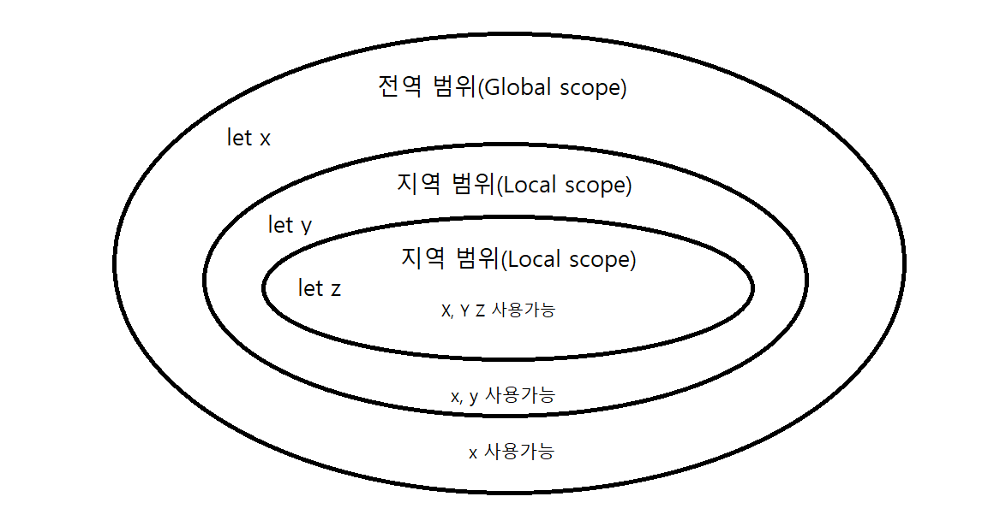

#### 스코프(Scope)란?
- 변수또는 함수의 식별자가 사용되는 유효범위이다.

```javascript
let name = "Lee";

function Hello () {
  let H = 'Hello!"
  console.log(H + name);
}
console.log(H);

// JS 코드 결과
Hello! Lee
참조오류(ReferenceError) // H 변수를 찾지 못한다.
```

#### 스코프의 규칙
1. 내부에서 정의된 변수는 외부 스코프에서 접근이 불가능
2. 외부에서 정의된 변수는 내부 스코프에 접근 가능
3. 지역 스코프가 전역 스코프보다 더 높은 우선순위를 가진다.


 #### 렉시컬 스코프(Lexical Scope)란?
 - 함수를 어디서 호출하는지가 아니라 어디에 선언하였는지에 따라 결정되는 것을 말한다.
 - 함수를 어디서 선언하였는지에 따라 상위 스코프를 결정하고, 중요한 점은 함수의 호출이 아니라 함수의 선언에 따라 결정되는 것을 말한다.
 - 정적 스코프(Static scope)라 부르기도 한다.
```javascipt
ex)
var x = 1; // 전역변수

function Test1() {
  var x = 2; // Test1함수 안에 지역변수
  Test2(); // Test1함수 밖의 Test2 함수 호출
}
function Test2() {
  console.log(x); // 변수 x의 값 출력
}
Test1(); // x는 1로 출력
Test2(); // x는 1로 출력
```
위와 같이 나온 이유는 JS에서는 이미 실행 단계에서 코드들의 스코프를 결정한다.
예시에서 Test2는 상위 스코프가 이미 x = 1로 선언되어 Test2에서는 1로나오고 Test1에서는 함수안에 x = 2라고 선언은 했지만 Test2는 이미 상위 스코프는 x = 1로 선언되있어
둘다 1로 출력이 되었다.
즉 함수를 어디에서 호출하였는지는 스코프 결정에 아무런 의미가 없다.

#### 결론
- JS에서는 렉시컬 스코프 따른다.
- 렉시컬 스코프는 함수의 호출이 아니라 함수의 선언에 따라 상위 스코프가 결정된다.
